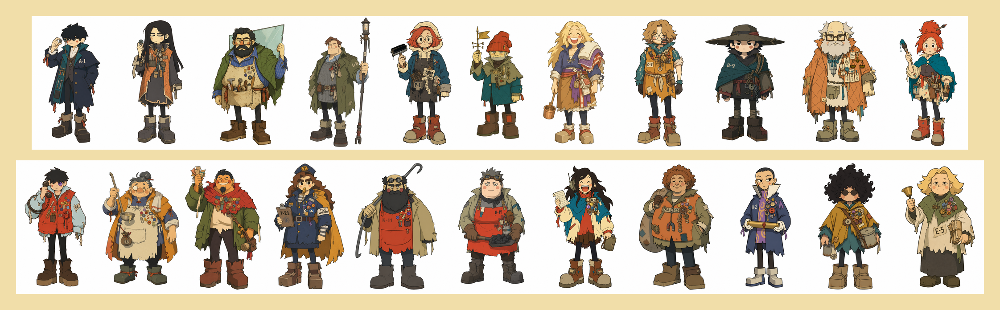
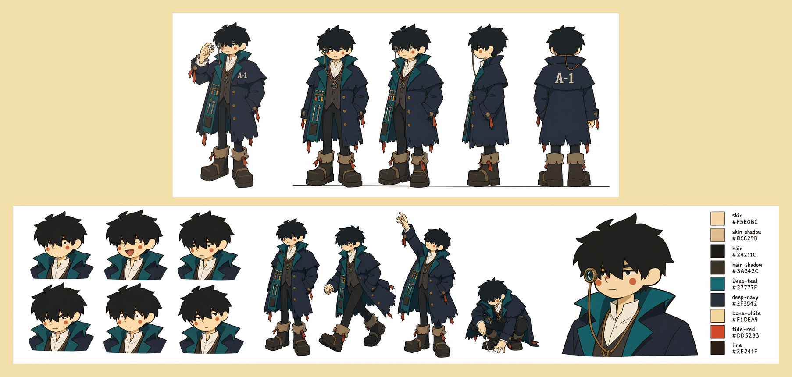
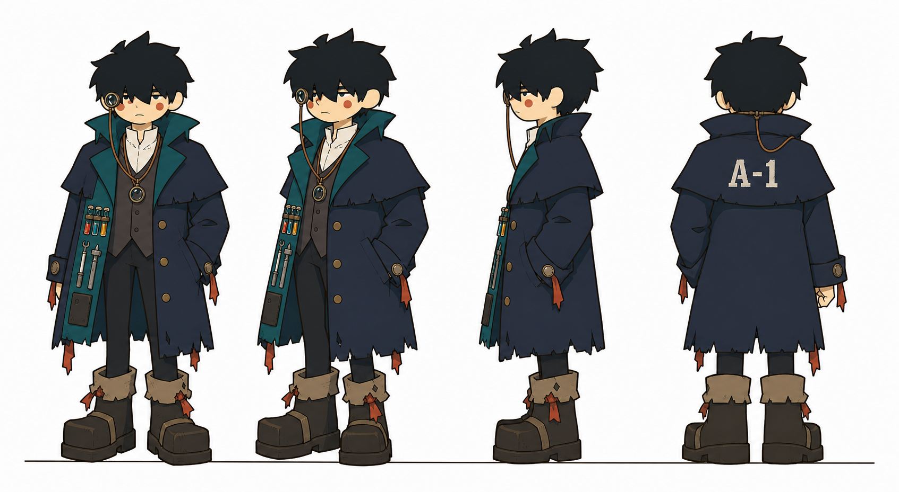
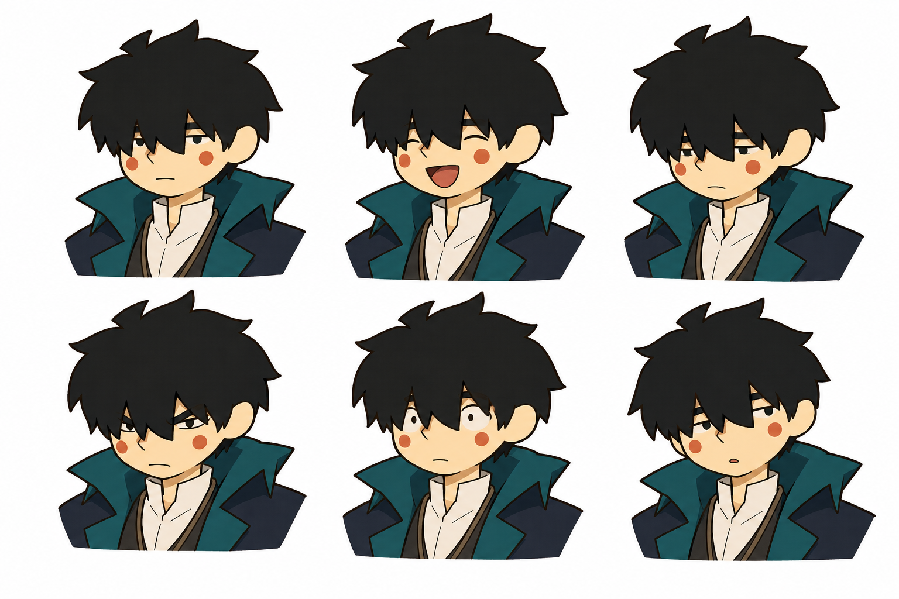
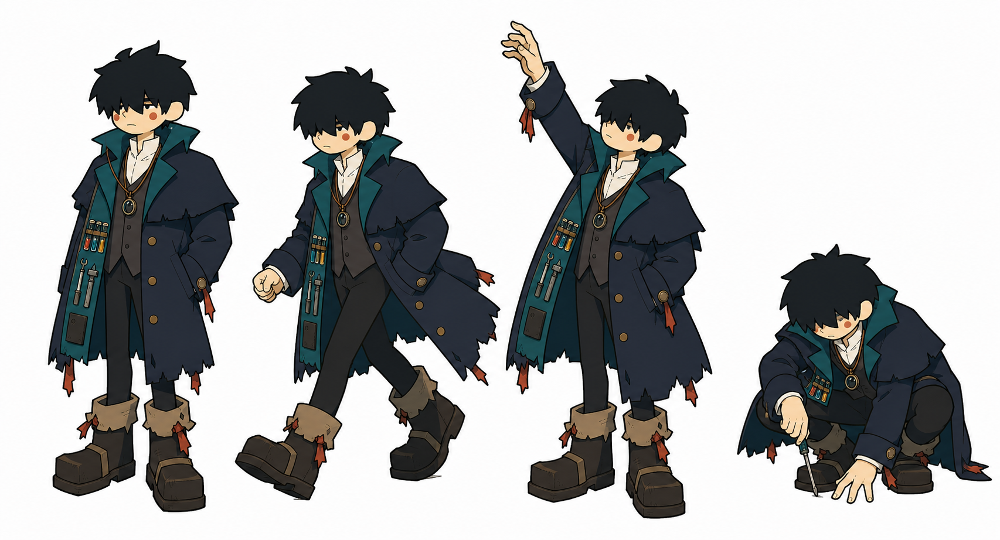
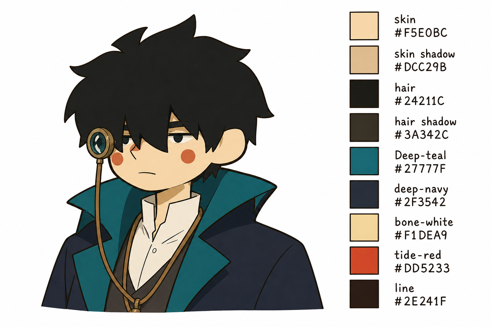
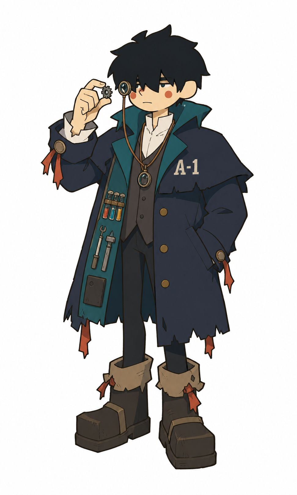
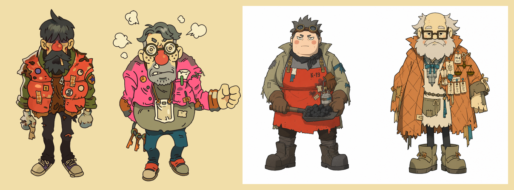

<div align="center">

# 一键穿越异世界

**发一张自拍，拿回一整套《锈汛》世界的角色设定。**

风来之国式赛璐璐平涂画风 · 五张一套的角色说明书 · 一条命令跑完



</div>

---

## 这是什么

一个 Claude Code / Codex skill。你给它一张真人照片，它把这个人**放进《锈汛 RUSTIDE》这个世界**——
给一个职业、一段来历、一身改造过的衣服——然后产出一整套可以直接用于游戏或漫剧的角色美术。

**产物是提示词，不是图。** 交给 Codex、GPT-Image 或任意生图 agent 执行。

---

## 一个角色 = 五张图



| # | 资产 | 内容 | 补的是什么 |
|---|---|---|---|
| 1 | **立绘** | 正面全身 | 这个人长什么样 |
| 2 | **三视图** | 正 / ¾ / 侧 / 背，同一地平线等高 | **背面和侧面**——最容易被现编的部分 |
| 3 | **表情表** | 平静 / 开心 / 难过 / 生气 / 惊讶 / 疑惑 | 情绪范围 |
| 4 | **动作表** | 站立 / 行走 / 举手 / 蹲低 | 动起来体块怎么变 |
| 5 | **色卡** | 头肩像 + 九个带 HEX 的色卡 | 配色的准确数值，**机器可读** |

每张都是**一张图里排多格**——同一次生成，细节天然一致。分开出必然漂移。

<table>
<tr>
<td width="50%"><br><sub><b>三视图</b> · 背面把编号、披肩片轮廓、目镜绳都定义出来</sub></td>
<td width="50%"><br><sub><b>表情表</b> · 六格只有眼眉嘴在变，其余逐项锁死</sub></td>
</tr>
<tr>
<td><br><sub><b>动作表</b> · 衣摆各自摆动，随身物跟着走</sub></td>
<td><br><sub><b>色卡</b> · 九色带 HEX，可直接当规格文件</sub></td>
</tr>
</table>

---

## 实际使用

<!-- USE-CASE-SCREENSHOT -->

<div align="center">

</div>

一张镜子自拍，出来的是**验样人 A-1**——在桥城和上环之间替人辨旧世零件真伪的年轻人。
设定里写着「**他身上的磨损比谁都少，这就是他的特征**」，配得上那身干净剪裁的长大衣。

照片里的东西一样没丢：厚重不齐刘海（放大成盖住上半脸的深色块）· 窄单眼皮 · 清瘦窄肩 ·
藏青双排扣长大衣带肩部披肩片 · 白立领。而**深青翻领、试剂瓶排、颈上放大目镜、`A-1` 编号**
是世界观长出来的，照片里一个都没有。

---

## 画风对标



左二是《风来之国》官方人设，右二是本 skill 的产出。

对齐的不只是"看起来像"——**线宽、暗部占比、彩度、暖色比例、轮廓曲率**
全部按官方图实测标定，`check.py` 出图后自动量。

---

## 怎么用

```bash
# 1. 抄模板，按照片填占位符
cat .claude/skills/rustide-artforge/templates/GOLD-from-scratch.txt

# 2. 出图前检查
python3 .claude/skills/rustide-artforge/checklists/check.py prompt.txt

# 3. 出图 —— 附两张参考图：比例锚 + 按招牌特征选的上墨锚

# 4. 出图后检查 —— 量平涂率、色密度，生成标尺图判头身比
python3 .claude/skills/rustide-artforge/checklists/check.py 出图.png
```

**跑一次只读一个文件**：[`RUN.md`](.claude/skills/rustide-artforge/RUN.md)（约 4400 tokens）——
步骤、上墨锚表、19 个职业、五个菜单、易错点全在里面。

`references/` 是**出问题时按症状查**的，跑的时候不读。症状对照表见
[`SKILL.md`](.claude/skills/rustide-artforge/SKILL.md)。

---

## 三层法

| 层 | 来源 | 决定什么 |
|---|---|---|
| **① 画法层** | 固定常量 | 五头身、压缩体型、暖褐线、平涂大色块 |
| **② 照片层** | 照片 | 五官、发型的形、四肢粗细、服装款式 |
| **③ 故事层** | 职业档案 + 小传 | 随身物、磨损来历、视觉母题、道具 |

三层互不覆盖。出问题先判断是哪一层，只改那一层。

---

## 世界观 ·《锈汛 RUSTIDE》

> 风从东边来的时候带着铁锈味。这是工业烧完之后的第三代人，
> 用蒸汽的骨头和电子的神经，在一个每年涨一次锈潮的世界里，继续过日子。

灾变不是核战不是瘟疫——是**东西开始生锈，而且不停下来**。每年秋天刮 9–12 天锈汛风。
这一条直接生成了整套服装语言：护目镜、面巾、油布、防锈蜡，都有物理理由。

**蒸汽是基础设施**（城市的声音是嘶嘶声），**赛博是个人层而且很穷**——
义肢是接线人用旧世零件手工接的，会漏油、会在锈汛天失灵。**赛博在这里等于修理，不等于超越。**

设定集在 [`references/world/`](.claude/skills/rustide-artforge/references/world/)：
纪年与灾变 · 19 份职业档案 · 日常细节（吃什么、用什么钱、怕什么）· 关键物件 · 角色名录。

---

## 结构

```
.claude/skills/rustide-artforge/
├── RUN.md                    跑一次只读这个
├── SKILL.md                  薄路由 + 按症状查表
├── templates/                立绘 / 三视图 / 表情表 / 动作表 / 色卡
├── checklists/check.py       唯一的工具，出图前后各跑一次
├── references/
│   ├── art-visual.md         线 / 色 / 光 / 质感
│   ├── art-design-direction.md  比例 / 脸 / 服装 / 杂物
│   ├── palette.md            调色板，色值实采自官方图
│   ├── photo-to-character.md 照片 → 角色 · 三层法
│   └── world/                设定集
└── assets/refs-cel/          官方参考图 16 张
角色成品/                      22 个角色，5 套完整资产
```

---

## 版权

`assets/refs-cel/` 是《风来之国 / Eastward》的官方美术图，著作权属 **Pixpil**，
仅作美术风格研究参考，出处见该目录 README。其余内容原创。
