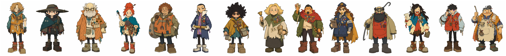

# RUSTIDE ARTFORGE ·《锈汛》角色美术生成 skill

把一张真人照片，锻成《锈汛 RUSTIDE》世界里的角色——**风来之国式赛璐璐平涂人设立绘**。

产物是**提示词**，不是图。交给 Codex / GPT-Image / 任意生图 agent 执行。



## 快速上手

跑一次**只读一个文件**：[`RUN.md`](.claude/skills/rustide-artforge/RUN.md)（约 2900 tokens）。
里面有步骤、上墨锚表、14 个职业、五个菜单、三条易错点。

```bash
python3 .claude/skills/rustide-artforge/checklists/check.py prompt.txt   # 出图前
python3 .claude/skills/rustide-artforge/checklists/check.py 出图.png      # 出图后
```

`references/` 是**出问题时按症状查**的，跑的时候不读——症状对照表见
[`SKILL.md`](.claude/skills/rustide-artforge/SKILL.md)（60 行）。

单次运行读取量从 45k tokens 降到 6.4k（**-86%**）。出图 API 本身约 67 秒。

## 一个角色 = 两张图

| 资产 | 模板 | 参考图 |
|---|---|---|
| **立绘** 全身人设 | `GOLD-from-scratch.txt` | `27-cast-lineup` + 按招牌特征选的上墨锚 |
| **表情表** 六格情绪 | `EXPRESSIONS.txt` | **该角色的立绘** |

表情表是**一张图里的六格网格**，不是六张图——动画业界的 model sheet 就是这么做的，
同一次生成细节天然一致。分六次出必然漂移。

## 结构

```
.claude/skills/rustide-artforge/
├── SKILL.md                        入口 · 做法 · 八条规矩 · 硬检查
├── templates/
│   ├── GOLD-from-scratch.txt       立绘主模板（参数化）
│   ├── EXPRESSIONS.txt             表情表模板（六格）
│   └── GOLD-v26-original.txt       实证配方原文，永不修改
├── references/
│   ├── art-visual.md               线 / 色 / 光 / 质感（含全部实测数据）
│   ├── art-design-direction.md     比例 / 脸 / 服装 / 女性角色
│   ├── palette.md                  调色板（色值实采自官方图）
│   ├── metrics.md                  八项指标的官图实测区间
│   ├── photo-to-character.md       照片 → 角色 · 三层法
│   └── world/                      设定集
│       ├── 00-core.md              纪年 · 灾变 · 技术水位 · 地理 · 视觉母题
│       ├── professions.md          八份职业档案（最能生图的一册）
│       ├── daily-life.md           吃 / 钱 / 广播 / 节庆 / 关键物件 / 大事件
│       └── cast.md                 角色名录 + 查重四条
├── checklists/check.py             唯一的工具
├── examples/worked-example.md      填空示范
├── assets/refs-cel/                官方参考图 16 张
└── _attic/                         已退役的 9 个工具与 27 条铁律
```

## 三层法

| 层 | 来源 | 决定什么 |
|---|---|---|
| **① 画法层** | 固定常量 | 五头身、`short stocky`、暖褐线、平涂 |
| **② 照片层** | 照片 | 五官、脸型、四肢粗细、发型形、服装款式 |
| **③ 故事层** | 小传 + 职业档案 | 随身物、磨损来历、母题、道具 |

三层互不覆盖。出问题先判断是哪一层。

## 实测记录

这个 skill 是通过约 40 张出图的闭环实验磨出来的，全部数据记在 `references/art-visual.md`。
几条代价最大的教训：

- **`short stocky body` 是画法常量。** 改成 `slim` 必出 7 头身，无一例外。
- **画风差距的根因是设计，不是渲染。** 大色块 + 细腿 + 细节成簇，把平涂率从 3.4% 拉到 14.8%。
- **采样方差比改进还大。** 同一提示词跑四次，离官图距离 0.87 / 1.64 / 1.05 / 2.89。**一次出 2–3 张，目视选片。**
- **`anime` / `black` / `muted` 等词会召唤模型的默认先验**，哪怕写在否定句里。
- **编辑模式会累积漂移。** 连改 8 次，头身比从 5 退到 7。本 skill 是**生成类**，`check.py` 会拦截编辑措辞。

## 版权

`assets/refs-cel/` 是《风来之国 / Eastward》的官方美术图，著作权属 **Pixpil**，
仅作美术风格研究参考。出处见该目录 README。其余内容为原创。
